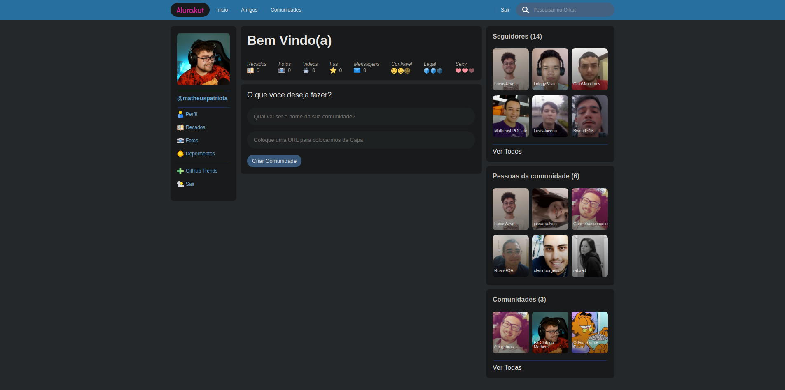

<h1 align="center">
    
</h1>

<br>

## 🧪 Tecnologias

Esse projeto foi desenvolvido com as seguintes tecnologias:

- [React](https://reactjs.org)
- [NextJs](https://nextjs.org/)
- [Dato](https://www.datocms.com/)

## 🚀 Como executar

Clone o projeto e acesse a pasta do mesmo.

```bash
$ git clone https://github.com/MatheusPatriota/Alurakut
$ cd Alurakut
```

Para iniciá-lo, siga os passos abaixo:
```bash
# Instalar as dependências
$ yarn

# Iniciar o projeto
$ yarn dev
```
O app estará disponível no seu browser pelo endereço http://localhost:3000.

Lembrando que será necessário criar uma conta no [Dato](https://www.datocms.com/) e um projeto para disponibilizar um Database.

## 💻 Projeto

AluraKut é um clone da antiga interface do Orkut e que utiliza a api do github para pegar as informações dos usuários e exibir na interface. 

Este é um projeto desenvolvido durante a **[Imersão Alura](https://www.alura.com.br/)**, apresentada dos dias 12 a 16 de Julho de 2021.